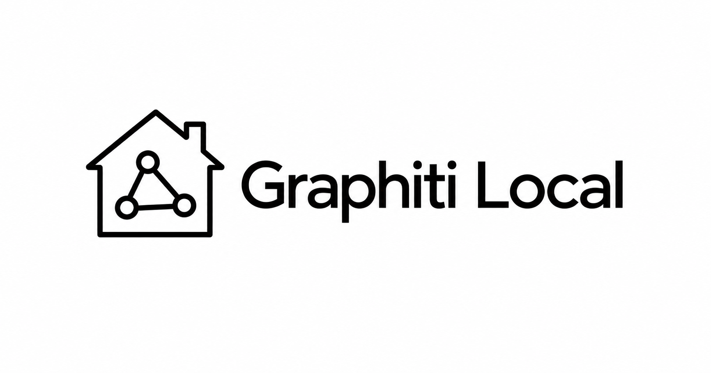
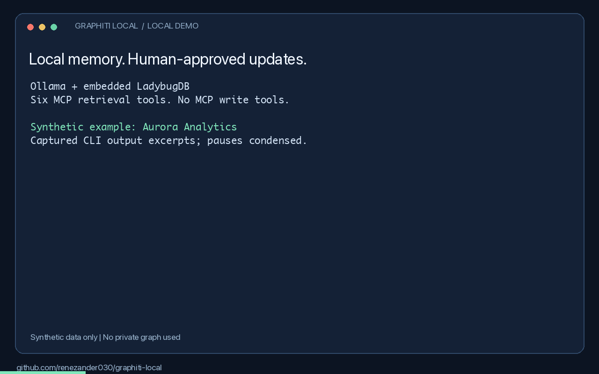

# Graphiti Local

**Local memory for your agents. You approve what they learn.**

Retrieve project decisions through six read-only MCP tools or the `kg` CLI.
Proposed updates stay in a separate queue until a human approves and applies them.
Ollama handles local inference; embedded LadybugDB stores the graph. No Docker or
cloud API key is needed for the local setup.



*Captured output excerpts with pauses condensed. [Measured results and limitations](docs/local-demo-results.md).*

## Try it in one command

```bash
uvx --from git+https://github.com/renezander030/graphiti-local kg-demo
```

Answers a question against a small synthetic graph shipped with the package. No Ollama,
no model downloads, no database setup: retrieval runs on keywords alone, so nothing
contacts a model. Ask your own question by passing it as an argument.

This is the read path only. Building a graph from your own text needs extraction, which
needs a model, and that is the full setup below.

## Try it locally

Install [uv](https://docs.astral.sh/uv/getting-started/installation/) and
[Ollama](https://docs.ollama.com/quickstart), then start Ollama. Setup downloads
need internet access. Run these commands in bash or zsh:

```bash
git clone https://github.com/renezander030/graphiti-local.git
cd graphiti-local
uv sync --frozen
ollama pull qwen2.5:7b
ollama pull nomic-embed-text
export GRAPHITI_LOCAL_CONFIG="$PWD/config/ollama.example.yaml"
export KG_WORKSPACE_DIR="$PWD/workspace/local-demo"
export KG_LADYBUG_PATH="$KG_WORKSPACE_DIR/graph.ladybug"
uv run --frozen kg-ladybug-setup --database "$KG_LADYBUG_PATH" --apply
uv run --frozen kg doctor
uv run --frozen kg-ingest examples/local_memory_demo.jsonl --apply
uv run --frozen kg ask "Which database does Aurora Analytics use?" example
```

The synthetic example returns **DuckDB**. Follow the [complete walkthrough](docs/local-quickstart.md)
to propose PostgreSQL, review and apply that update, and retrieve it from an MCP client.
Model extraction can be wrong; inspect the returned facts and validity timestamps.

## Is it a fit?

Use it for local agent memory with explicit human review. Skip it if you need
agents to write through MCP or want a hosted service without local setup.
FalkorDB and Neo4j are also supported.

- [Setup and MCP configuration](docs/local-quickstart.md)
- [Commands, ingestion, backups, and deployment](docs/reference.md)
- [Privacy](PRIVACY.md) · [Security](SECURITY.md) · [Container discovery](docs/container.md)
- [Report a successful or blocked setup](https://github.com/renezander030/graphiti-local/issues/new?template=setup-result.yml)

If this helps your workflow, star the repository and share your setup result.

Maintained by [René Zander](https://renezander.com/projects/graphiti-local/), who builds context layers for AI agents on temporal knowledge graphs.

Independent community project built on [Graphiti](https://github.com/getzep/graphiti),
not affiliated with or endorsed by Zep. [Apache-2.0](LICENSE).
